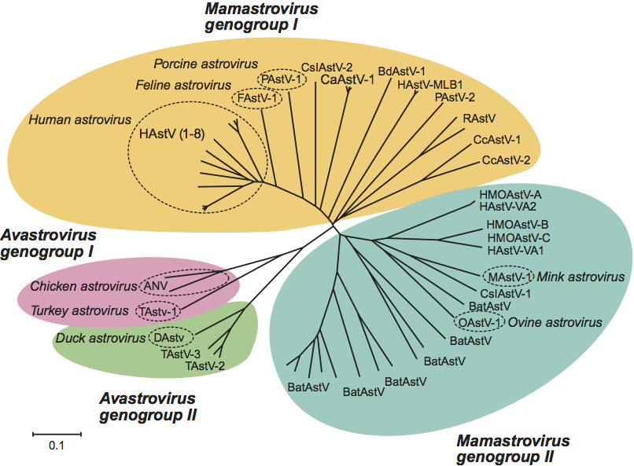

# Astroviridae
The project on analysis and research of Astroviridae 

## Overview

Astroviridae is a R package used to investigate the sequences and evolution of diverse viruses from Astroviridae.



## Installation

To install the Astroviridae, install from github using devtools

``` r
library(Astroviridae)
install_github("libcell/Astroviridae")
```

Or you can download the .ZIP file and unzip it.
 
``` r
install.packages("Astroviridae", repos = NULL, type = "source")
# The "Astroviridae" should be combined with the absolute path.
```

## Usage

It’s hard to succinctly describe how Astroviridae works because it embodies a 
deep philosophy of visualization. 

## Contact email

Please don't hesitate to address comments/questions/suggestions regarding this R 
package to: Bo Li libcell@cqnu.edu.cn
